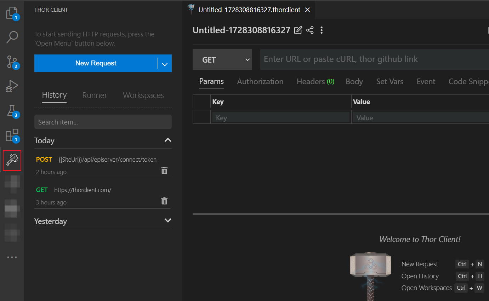

After you install the extension, there will be "hammer" icon on the Action Bar.

  

- Website <a href="https://thorclient.com/" target="_blank">www.thorclient.com</a>

# Thor Client
Thor Client is truly offline API Client that manage request collections inside VSCode.
Local first and using git for sharing requests with team.

You can report any Bugs Or Feature requests [here](https://github.com/thorclient/thor-client-support/issues).

## How to Use

- Install the extension, click the Thor Client icon on the Action Bar.
- From the sidebar click `New Request` button to test API

## Main Features

- **Lightweight** and easy to use REST API Client.
- Supports **Collections and Environment variables**.
- **Scriptless Testing:** Easily test API responses with a GUI-based interface.
- **File Storage:** The extension saves all data locally on the user's file system.
- **Git Sync:** Save requests data in your Git repository for team collaboration.

### License
Licensed under MIT
